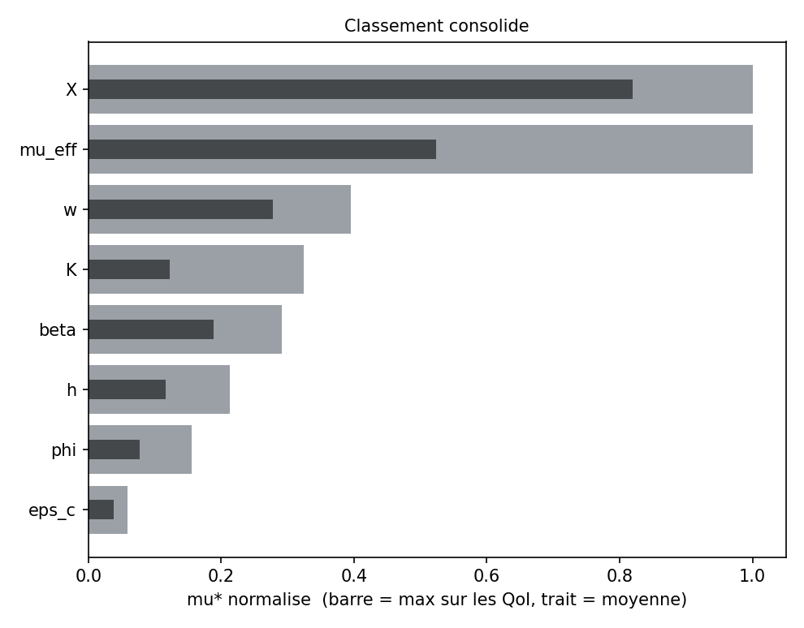
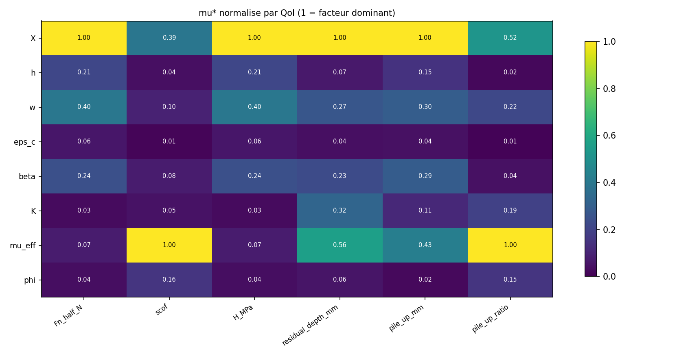
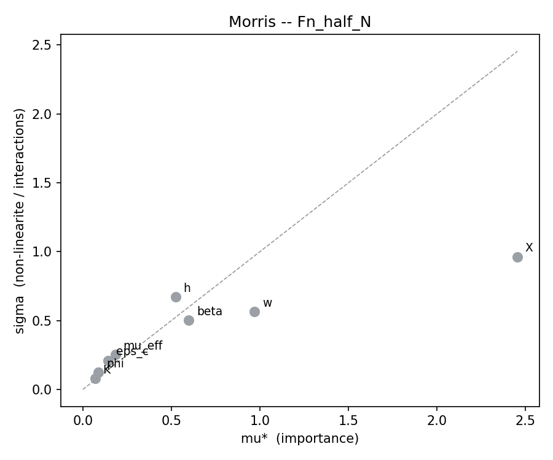
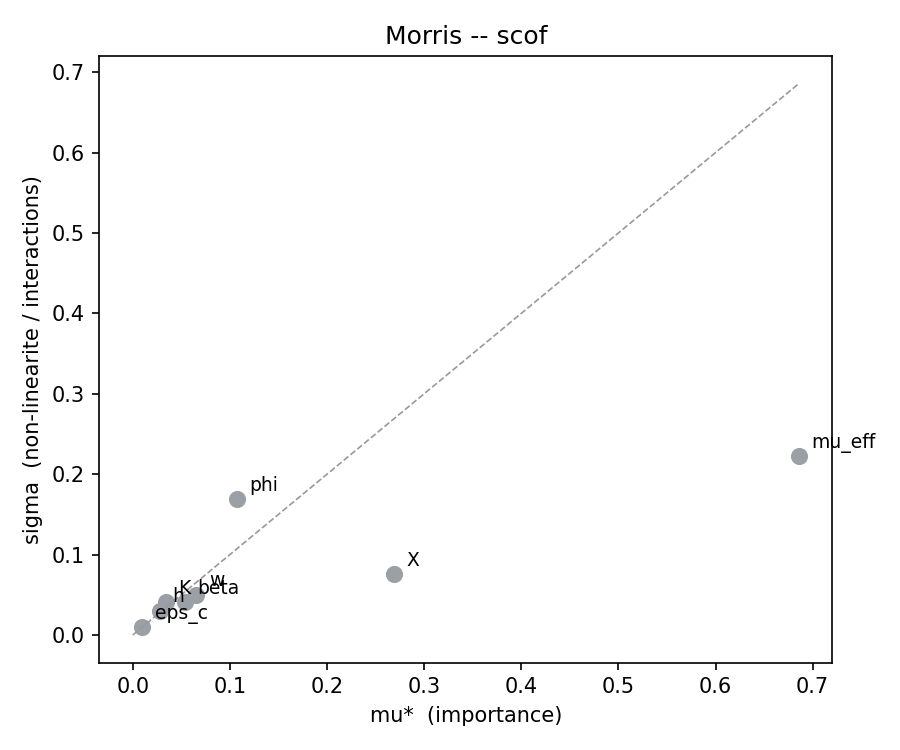
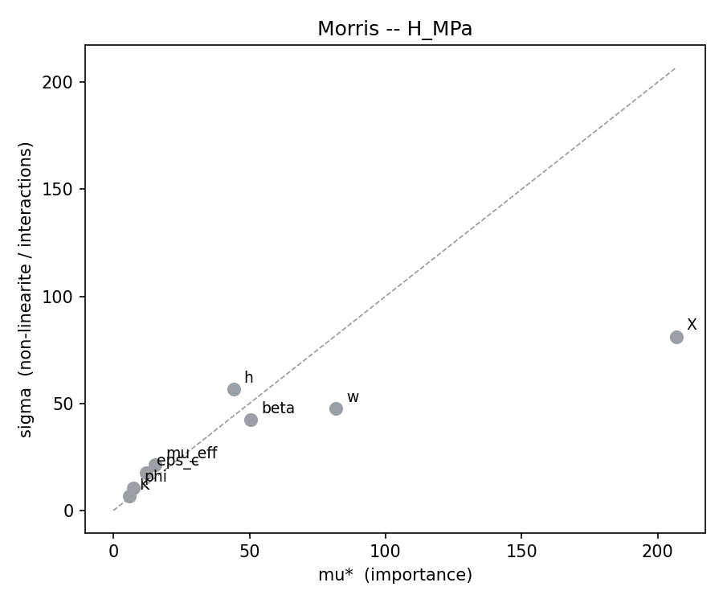
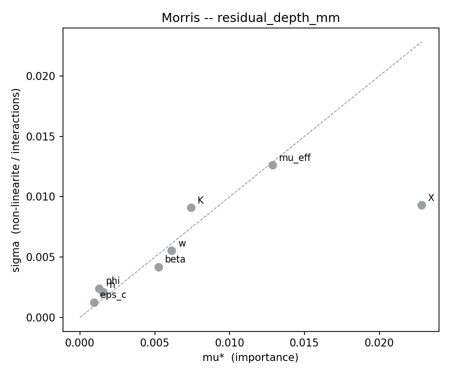
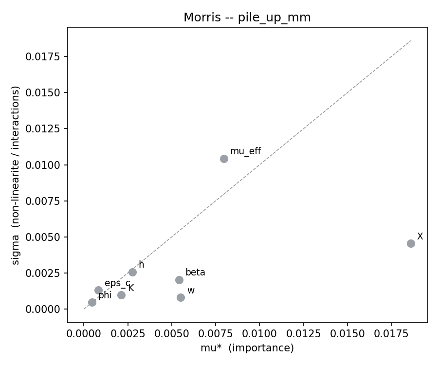
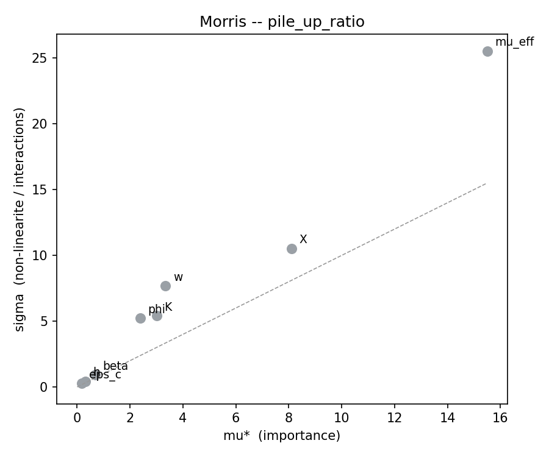

# Criblage Morris -- campagne Drucker-Prager unifiee

| | |
|---|---|
| Campagne | `CDP_drucker_prager_unified` |
| Famille hote | `glassy_pc` |
| Facteurs | 8 : `X`, `h`, `w`, `eps_c`, `beta`, `K`, `mu_eff`, `phi` |
| Trajectoires r | 10 |
| Pas Delta | 0.666667 |
| Runs prevus / exploitables | 90 / 58 |
| Trajectoires completes | 4 / 10 |
| Plancher de bruit | **absent : aucune decision rendue** |
| QoI analysees | 6 |
| Correction de multiplicite | alpha/6 sur les QoI (percentile bootstrap 0.833%) |

> **32 run(s) manquant(s) ou en echec.** Chaque point manquant detruit deux effets elementaires. Points concernes : 00012, 00013, 00014, 00015, 00016, 00017, 00018, 00037, 00038, 00039, 00040, 00041, 00042, 00043, 00050, 00051, 00052, 00053, 00054, 00057, 00058, 00059, 00060, 00061, 00062

## 1. Classement consolide

Regle appliquee : un facteur est **retenu s'il depasse le seuil de bruit pour au moins une QoI**. `mu*` est normalise par QoI (1 = facteur dominant de cette QoI), ce qui rend les colonnes comparables entre QoI d'unites differentes.

Cette regle est une **union de 6 tests par facteur**. Sans correction, le risque de retenir a tort un facteur nul atteindrait 26% ; le seuil bootstrap est donc corrige en alpha/6.

| Facteur | mu* max | mu* moyen | meilleur rang | rang moyen | sigma/mu* max | mu*/seuil | QoI decisives | Verdict |
|---|---|---|---|---|---|---|---|---|
| `X` | 1 | 0.819 | 1 | 1.33 | 1.3 | - | - | **n/a** |
| `mu_eff` | 1 | 0.524 | 1 | 2.67 | 1.65 | - | - | **n/a** |
| `w` | 0.395 | 0.278 | 2 | 3 | 2.3 | - | - | **n/a** |
| `K` | 0.324 | 0.123 | 3 | 5.83 | 1.8 | - | - | **n/a** |
| `beta` | 0.291 | 0.188 | 3 | 4.33 | 1.38 | - | - | **n/a** |
| `h` | 0.213 | 0.117 | 4 | 5.5 | 1.39 | - | - | **n/a** |
| `phi` | 0.156 | 0.0773 | 3 | 6.17 | 2.19 | - | - | **n/a** |
| `eps_c` | 0.0588 | 0.038 | 6 | 7.17 | 1.64 | - | - | **n/a** |

**Lecture.** Un `sigma/mu*` superieur a 1.0 signale un facteur dont l'effet est domine par les interactions ou par une forte non-linearite : Morris ne distingue pas les deux, seul le Sobol le fera. Un ecart important entre le meilleur rang et le rang moyen signale un facteur specifique a une QoI.

## 2. Detail par QoI

### `Fn_half_N` -- Force normale (demi-modele) [N]

46 effets elementaires, 32 point(s) manquant(s). Pas de plancher de bruit fourni.

| Facteur | mu* | mu*_lo | mu*_hi | sigma | sigma/mu* | mu*/seuil | mu signe | n_eff | Verdict |
|---|---|---|---|---|---|---|---|---|---|
| `X` | 2.454 | 1.384 | 3.185 | 0.9621 | 0.392 | - | 2.454 | 6 | n/a |
| `w` | 0.97 | 0.4191 | 1.468 | 0.5636 | 0.581 | - | 0.97 | 6 | n/a |
| `beta` | 0.5992 | 0.1912 | 1.047 | 0.5036 | 0.84 | - | 0.5992 | 7 | n/a |
| `h` | 0.5233 | 0.0943 | 1.286 | 0.6717 | 1.28 | - | 0.5233 | 6 | n/a |
| `mu_eff` | 0.1835 | 0.03733 | 0.3468 | 0.2519 | 1.37 | - | 0.04089 | 5 | n/a |
| `eps_c` | 0.1442 | 0.03118 | 0.2989 | 0.2113 | 1.47 | - | -0.01459 | 5 | n/a |
| `phi` | 0.08859 | 0.01722 | 0.2062 | 0.1234 | 1.39 | - | 0.05198 | 5 | n/a |
| `K` | 0.06876 | 0.02151 | 0.1419 | 0.07825 | 1.14 | - | -0.05745 | 6 | n/a |

### `scof` -- Coefficient de frottement apparent [-]

46 effets elementaires, 32 point(s) manquant(s). Pas de plancher de bruit fourni.

| Facteur | mu* | mu*_lo | mu*_hi | sigma | sigma/mu* | mu*/seuil | mu signe | n_eff | Verdict |
|---|---|---|---|---|---|---|---|---|---|
| `mu_eff` | 0.6859 | 0.5253 | 0.9567 | 0.2227 | 0.325 | - | 0.6859 | 5 | n/a |
| `X` | 0.2693 | 0.196 | 0.3317 | 0.07547 | 0.28 | - | 0.2693 | 6 | n/a |
| `phi` | 0.1069 | 0.01451 | 0.2813 | 0.1687 | 1.58 | - | -0.05758 | 5 | n/a |
| `w` | 0.0655 | 0.02327 | 0.1141 | 0.05023 | 0.767 | - | -0.06437 | 6 | n/a |
| `beta` | 0.05354 | 0.02596 | 0.09418 | 0.04085 | 0.763 | - | -0.05354 | 7 | n/a |
| `K` | 0.03402 | 0.004646 | 0.07563 | 0.04056 | 1.19 | - | -0.03402 | 6 | n/a |
| `h` | 0.02763 | 0.005579 | 0.05936 | 0.03041 | 1.1 | - | -0.02641 | 6 | n/a |
| `eps_c` | 0.009901 | 0.003888 | 0.0175 | 0.009717 | 0.981 | - | 0.007606 | 5 | n/a |

### `H_MPa` -- Durete de rayage Fn/A_c [MPa]

46 effets elementaires, 32 point(s) manquant(s). Pas de plancher de bruit fourni.

| Facteur | mu* | mu*_lo | mu*_hi | sigma | sigma/mu* | mu*/seuil | mu signe | n_eff | Verdict |
|---|---|---|---|---|---|---|---|---|---|
| `X` | 207 | 116.7 | 268.6 | 81.14 | 0.392 | - | 207 | 6 | n/a |
| `w` | 81.8 | 35.34 | 123.8 | 47.53 | 0.581 | - | 81.8 | 6 | n/a |
| `beta` | 50.53 | 16.12 | 88.34 | 42.47 | 0.84 | - | 50.53 | 7 | n/a |
| `h` | 44.13 | 7.953 | 108.4 | 56.64 | 1.28 | - | 44.13 | 6 | n/a |
| `mu_eff` | 15.47 | 3.148 | 29.25 | 21.24 | 1.37 | - | 3.448 | 5 | n/a |
| `eps_c` | 12.16 | 2.63 | 25.21 | 17.82 | 1.47 | - | -1.23 | 5 | n/a |
| `phi` | 7.471 | 1.453 | 17.39 | 10.4 | 1.39 | - | 4.384 | 5 | n/a |
| `K` | 5.799 | 1.814 | 11.97 | 6.599 | 1.14 | - | -4.845 | 6 | n/a |

### `residual_depth_mm` -- Profondeur residuelle [mm]

46 effets elementaires, 32 point(s) manquant(s). Pas de plancher de bruit fourni.

| Facteur | mu* | mu*_lo | mu*_hi | sigma | sigma/mu* | mu*/seuil | mu signe | n_eff | Verdict |
|---|---|---|---|---|---|---|---|---|---|
| `X` | 0.02283 | 0.01575 | 0.03271 | 0.009312 | 0.408 | - | 0.02283 | 6 | n/a |
| `mu_eff` | 0.01287 | 0.004168 | 0.02656 | 0.01262 | 0.98 | - | -0.01201 | 5 | n/a |
| `K` | 0.007409 | 0.002495 | 0.01436 | 0.009104 | 1.23 | - | 0.004746 | 6 | n/a |
| `w` | 0.006133 | 0.003035 | 0.009259 | 0.005532 | 0.902 | - | -0.004606 | 6 | n/a |
| `beta` | 0.005241 | 0.001918 | 0.008705 | 0.004193 | 0.8 | - | -0.005104 | 7 | n/a |
| `h` | 0.00154 | 0.0003699 | 0.002677 | 0.002101 | 1.36 | - | -5.893e-06 | 6 | n/a |
| `phi` | 0.001284 | 0.0001945 | 0.003961 | 0.002413 | 1.88 | - | 0.000825 | 5 | n/a |
| `eps_c` | 0.0009289 | 0.0002832 | 0.002189 | 0.00126 | 1.36 | - | 0.0006519 | 5 | n/a |

### `pile_up_mm` -- Bourrelet lateral [mm]

46 effets elementaires, 32 point(s) manquant(s). Pas de plancher de bruit fourni.

| Facteur | mu* | mu*_lo | mu*_hi | sigma | sigma/mu* | mu*/seuil | mu signe | n_eff | Verdict |
|---|---|---|---|---|---|---|---|---|---|
| `X` | 0.0186 | 0.01496 | 0.0235 | 0.004553 | 0.245 | - | 0.0186 | 6 | n/a |
| `mu_eff` | 0.00796 | 0.0007643 | 0.01967 | 0.01044 | 1.31 | - | 0.007346 | 5 | n/a |
| `w` | 0.005508 | 0.004953 | 0.006355 | 0.0008046 | 0.146 | - | -0.005508 | 6 | n/a |
| `beta` | 0.005409 | 0.003513 | 0.007081 | 0.002038 | 0.377 | - | -0.005409 | 7 | n/a |
| `h` | 0.002749 | 0.0009237 | 0.004686 | 0.002572 | 0.936 | - | -0.002278 | 6 | n/a |
| `K` | 0.002132 | 0.001322 | 0.003186 | 0.0009704 | 0.455 | - | 0.002132 | 6 | n/a |
| `eps_c` | 0.0008283 | 9.304e-05 | 0.002142 | 0.001302 | 1.57 | - | -0.0004717 | 5 | n/a |
| `phi` | 0.0004641 | 0.0001178 | 0.001066 | 0.0004722 | 1.02 | - | 0.0004641 | 5 | n/a |

### `pile_up_ratio` -- Bourrelet / profondeur residuelle [-]

46 effets elementaires, 32 point(s) manquant(s). Pas de plancher de bruit fourni.

| Facteur | mu* | mu*_lo | mu*_hi | sigma | sigma/mu* | mu*/seuil | mu signe | n_eff | Verdict |
|---|---|---|---|---|---|---|---|---|---|
| `mu_eff` | 15.5 | 0.5101 | 47.6 | 25.54 | 1.65 | - | 15.47 | 5 | n/a |
| `X` | 8.101 | 1.517 | 17.75 | 10.53 | 1.3 | - | -7.085 | 6 | n/a |
| `w` | 3.342 | 0.1415 | 12.65 | 7.693 | 2.3 | - | -3.121 | 6 | n/a |
| `K` | 3.006 | 0.2814 | 9.319 | 5.419 | 1.8 | - | -2.693 | 6 | n/a |
| `phi` | 2.391 | 0.02291 | 8.742 | 5.228 | 2.19 | - | -2.251 | 5 | n/a |
| `beta` | 0.6761 | 0.2738 | 1.259 | 0.9301 | 1.38 | - | -0.1408 | 7 | n/a |
| `h` | 0.312 | 0.06915 | 0.6393 | 0.4351 | 1.39 | - | -0.1487 | 6 | n/a |
| `eps_c` | 0.1636 | 0.01179 | 0.4331 | 0.2685 | 1.64 | - | 0.06226 | 5 | n/a |

## 3. Decision

Aucun plancher de bruit n'a ete fourni : les `mu*` et `sigma` ci-dessus sont valides, mais **aucune retention ni gel n'est prononce**. Mesurer d'abord `sigma_num` avec `noise_floor.py`, puis relancer.

## 3bis. Identifiabilite et plancher structurel

### Signature de confusion entre facteurs

Aucune paire au-dessus du seuil 0.55 : pas de signature de confusion detectee.

| Paire | indice | QoI |
|---|---|---|
| `beta` / `K` | 0.171 | 6 |
| `X` / `mu_eff` | 0.164 | 6 |
| `w` / `mu_eff` | 0.156 | 6 |
| `w` / `K` | 0.151 | 6 |
| `h` / `K` | 0.144 | 6 |
| `K` / `phi` | 0.127 | 6 |
| `X` / `w` | 0.123 | 6 |
| `beta` / `mu_eff` | 0.119 | 6 |

### Plancher de bruit structurel

_Aucune relation d'inertie declaree (`--gates`)._

## 4. Reserves

- Le classement vaut pour la **classe Drucker-Prager**, pas pour une famille particuliere : `semicrystalline_*` et `glassy_*` sont des points d'une meme boite adimensionnelle. Aucun `mu*` propre a PMMA ou PC n'en sort.
- La boite unifiee couvre des regimes physiques differents (adoucissement present ou absent). Un `sigma` eleve peut refleter ce melange plutot qu'une interaction.
- `h` intervient via `exp(h*eps^2)` evalue jusqu'a eps_max : une non-linearite forte sur ce facteur est attendue par construction du modele.
- A `phi = 1` le modele de frottement bascule de table tabulee vers Coulomb constant. Verifier que `phi = 0.99` et `phi = 1.00` donnent le meme resultat avant d'interpreter le `mu*` de `phi`.
