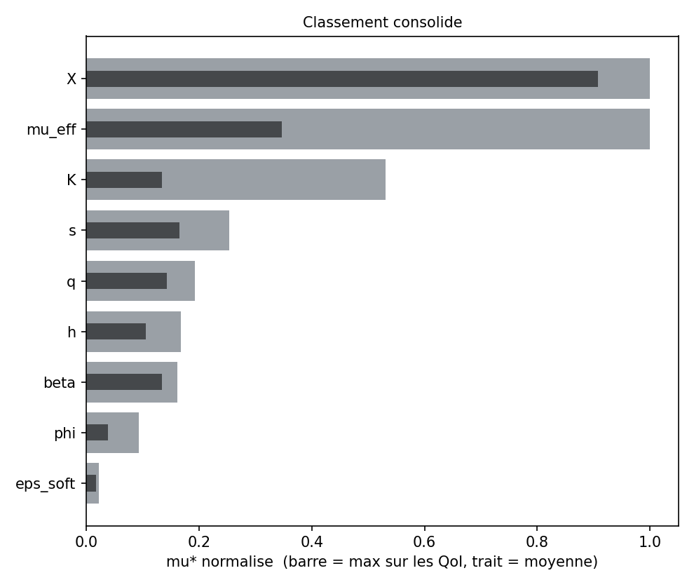
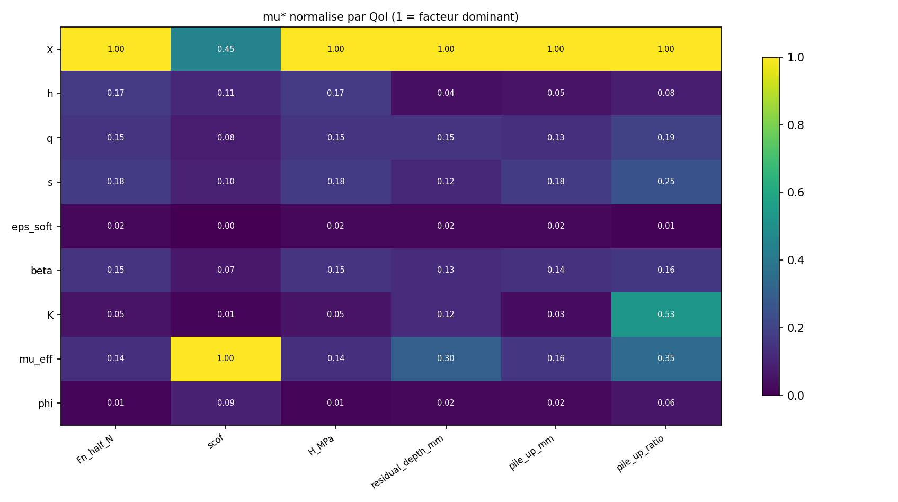
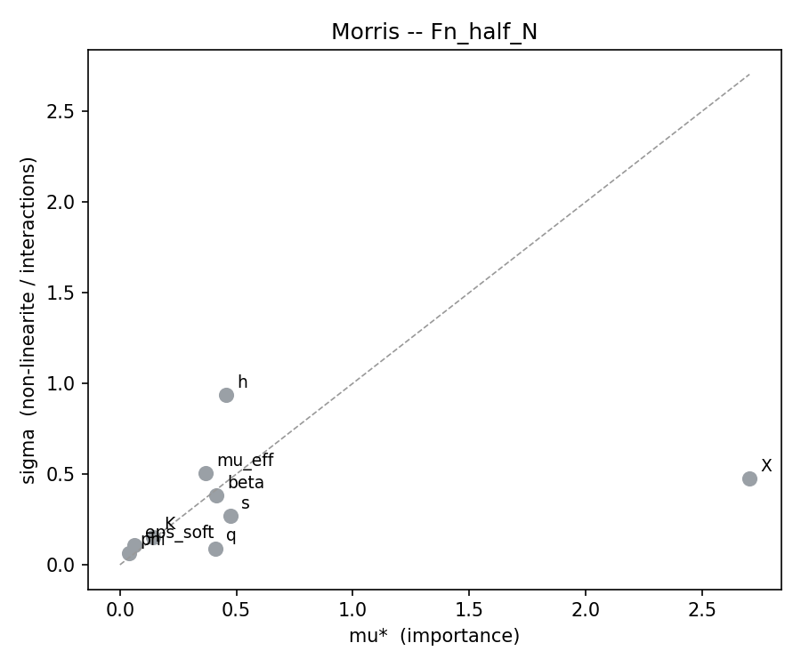
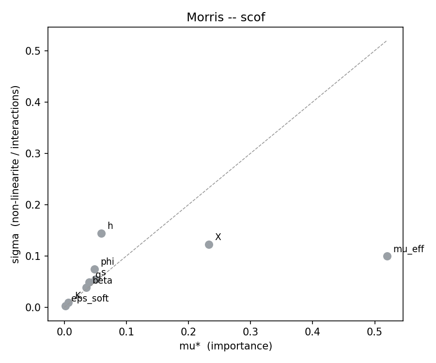
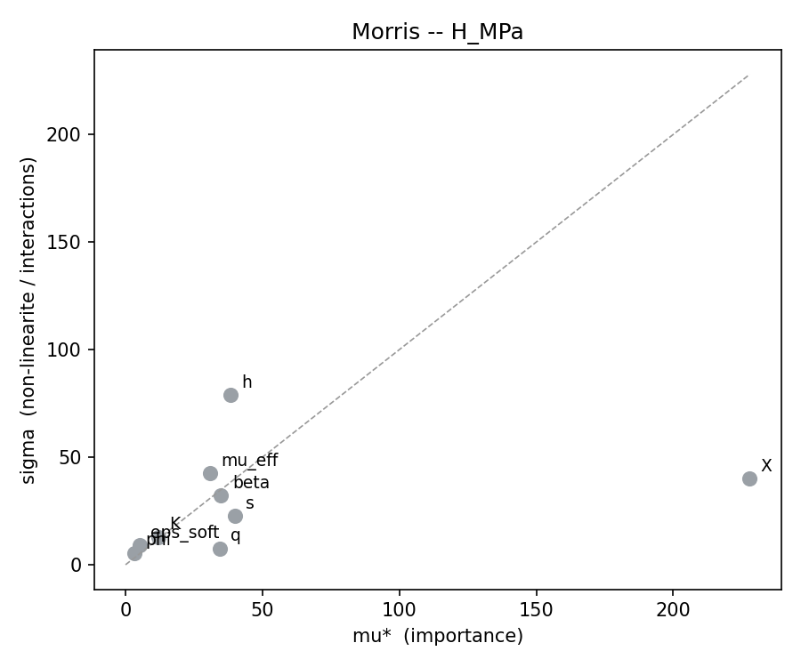
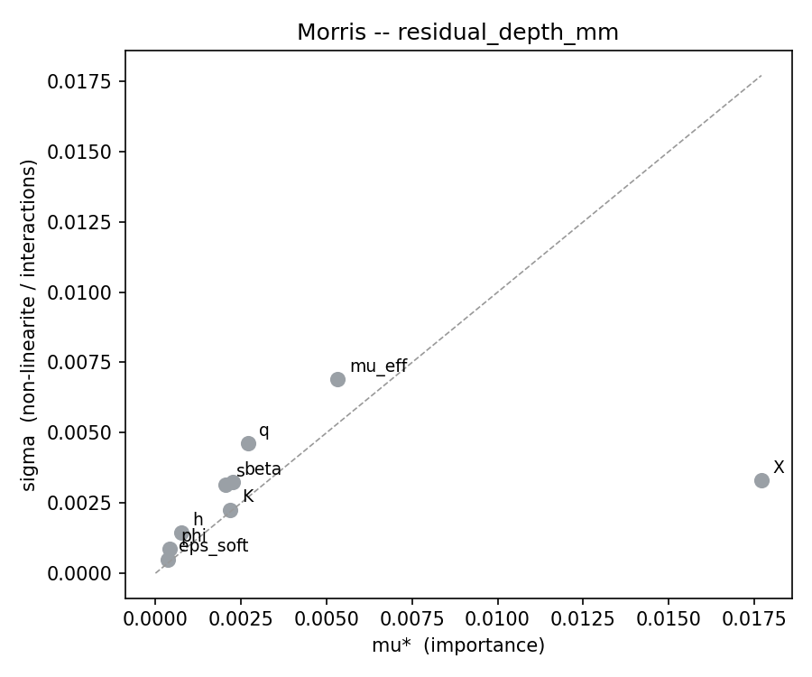
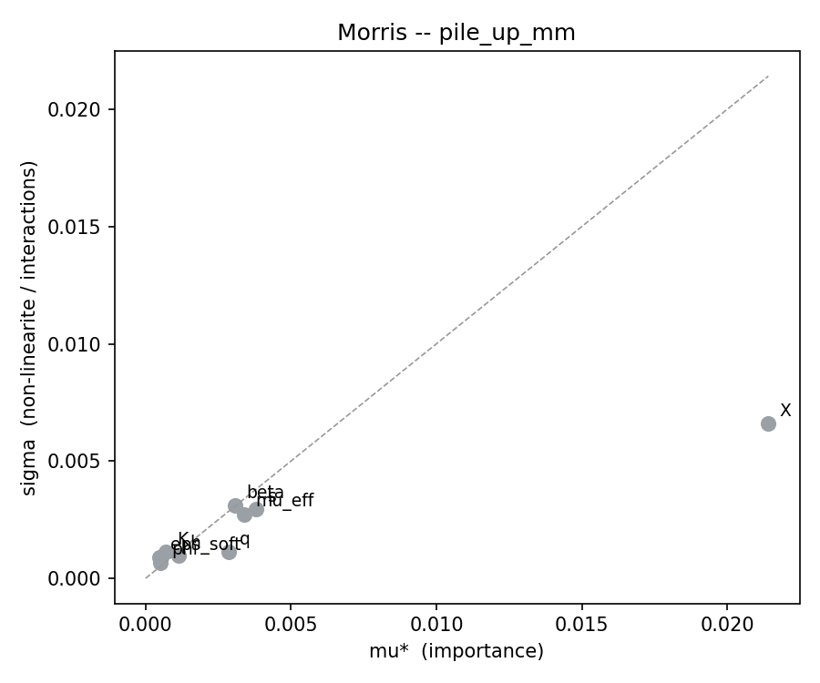
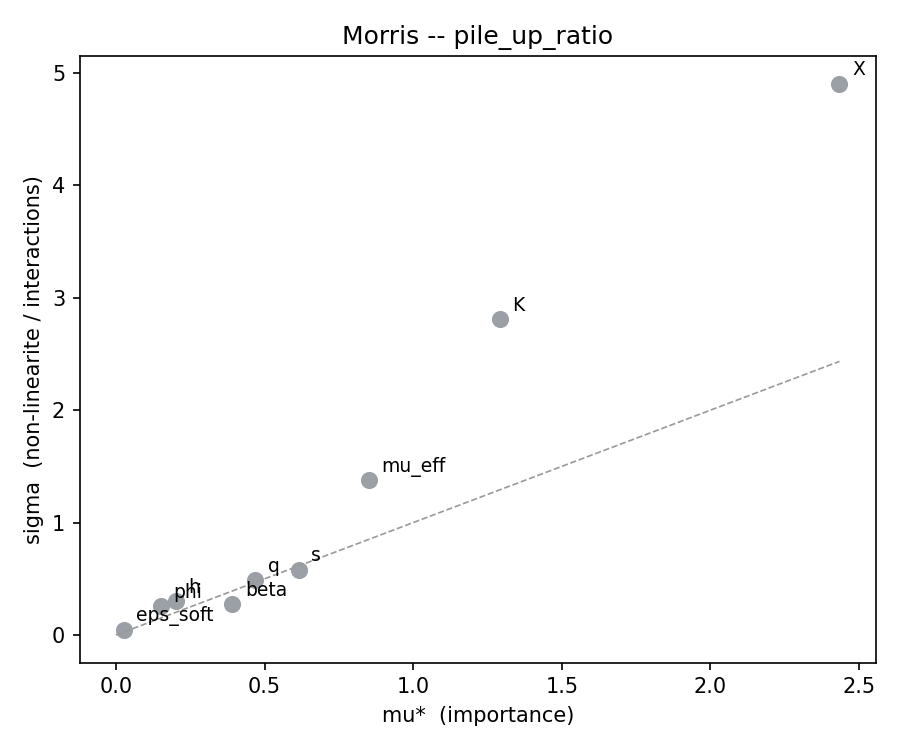

# Criblage Morris -- campagne Drucker-Prager unifiee

| | |
|---|---|
| Campagne | `CDP_drucker_prager_unified` |
| Famille hote | `glassy_pc` |
| Facteurs | 9 : `X`, `h`, `q`, `s`, `eps_soft`, `beta`, `K`, `mu_eff`, `phi` |
| Trajectoires r | 10 |
| Pas Delta | 0.666667 |
| Runs prevus / exploitables | 100 / 67 |
| Trajectoires completes | 4 / 10 |
| Plancher de bruit | **absent : aucune decision rendue** |
| QoI analysees | 6 |
| Correction de multiplicite | alpha/6 sur les QoI (percentile bootstrap 0.833%) |

> **33 run(s) manquant(s) ou en echec.** Chaque point manquant detruit deux effets elementaires. Points concernes : 00004, 00011, 00012, 00013, 00014, 00015, 00016, 00017, 00018, 00019, 00020, 00026, 00027, 00028, 00029, 00030, 00041, 00042, 00043, 00044, 00045, 00046, 00047, 00048, 00051

## 1. Classement consolide

Regle appliquee : un facteur est **retenu s'il depasse le seuil de bruit pour au moins une QoI**. `mu*` est normalise par QoI (1 = facteur dominant de cette QoI), ce qui rend les colonnes comparables entre QoI d'unites differentes.

Cette regle est une **union de 6 tests par facteur**. Sans correction, le risque de retenir a tort un facteur nul atteindrait 26% ; le seuil bootstrap est donc corrige en alpha/6.

| Facteur | mu* max | mu* moyen | meilleur rang | rang moyen | sigma/mu* max | mu*/seuil | QoI decisives | Verdict |
|---|---|---|---|---|---|---|---|---|
| `X` | 1 | 0.908 | 1 | 1.17 | 2.02 | - | - | **n/a** |
| `mu_eff` | 1 | 0.347 | 1 | 3.5 | 1.62 | - | - | **n/a** |
| `K` | 0.53 | 0.134 | 2 | 6 | 2.18 | - | - | **n/a** |
| `s` | 0.253 | 0.165 | 2 | 3.33 | 1.54 | - | - | **n/a** |
| `q` | 0.193 | 0.143 | 3 | 4.83 | 1.7 | - | - | **n/a** |
| `h` | 0.168 | 0.105 | 3 | 4.83 | 2.43 | - | - | **n/a** |
| `beta` | 0.161 | 0.134 | 4 | 4.83 | 1.43 | - | - | **n/a** |
| `phi` | 0.093 | 0.0385 | 5 | 7.83 | 2.17 | - | - | **n/a** |
| `eps_soft` | 0.0224 | 0.0166 | 8 | 8.67 | 2.05 | - | - | **n/a** |

**Lecture.** Un `sigma/mu*` superieur a 1.0 signale un facteur dont l'effet est domine par les interactions ou par une forte non-linearite : Morris ne distingue pas les deux, seul le Sobol le fera. Un ecart important entre le meilleur rang et le rang moyen signale un facteur specifique a une QoI.

## 2. Detail par QoI

### `Fn_half_N` -- Force normale (demi-modele) [N]

56 effets elementaires, 33 point(s) manquant(s). Pas de plancher de bruit fourni.

| Facteur | mu* | mu*_lo | mu*_hi | sigma | sigma/mu* | mu*/seuil | mu signe | n_eff | Verdict |
|---|---|---|---|---|---|---|---|---|---|
| `X` | 2.703 | 2.448 | 3.013 | 0.4743 | 0.175 | - | 2.703 | 7 | n/a |
| `s` | 0.4733 | 0.2427 | 0.6279 | 0.2694 | 0.569 | - | -0.4733 | 7 | n/a |
| `h` | 0.4549 | 0.01534 | 1.085 | 0.9344 | 2.05 | - | 0.4549 | 7 | n/a |
| `beta` | 0.4139 | 0.1185 | 0.6454 | 0.3824 | 0.924 | - | 0.4139 | 7 | n/a |
| `q` | 0.408 | 0.3065 | 0.4656 | 0.09039 | 0.222 | - | 0.408 | 5 | n/a |
| `mu_eff` | 0.3665 | 0.04673 | 0.6941 | 0.5035 | 1.37 | - | -0.2235 | 4 | n/a |
| `K` | 0.1412 | 0.03059 | 0.2353 | 0.153 | 1.08 | - | -0.1412 | 7 | n/a |
| `eps_soft` | 0.06061 | 0 | 0.1379 | 0.1077 | 1.78 | - | 0.06061 | 5 | n/a |
| `phi` | 0.0392 | 0.006735 | 0.0714 | 0.06524 | 1.66 | - | -0.007163 | 7 | n/a |

### `scof` -- Coefficient de frottement apparent [-]

56 effets elementaires, 33 point(s) manquant(s). Pas de plancher de bruit fourni.

| Facteur | mu* | mu*_lo | mu*_hi | sigma | sigma/mu* | mu*/seuil | mu signe | n_eff | Verdict |
|---|---|---|---|---|---|---|---|---|---|
| `mu_eff` | 0.5197 | 0.3741 | 0.5832 | 0.09964 | 0.192 | - | 0.5197 | 4 | n/a |
| `X` | 0.2329 | 0.1109 | 0.2967 | 0.1227 | 0.527 | - | 0.2312 | 7 | n/a |
| `h` | 0.05948 | 0.001704 | 0.1577 | 0.1446 | 2.43 | - | -0.05906 | 7 | n/a |
| `s` | 0.04995 | 0.01229 | 0.08511 | 0.05483 | 1.1 | - | 0.04995 | 7 | n/a |
| `phi` | 0.04834 | 0.009384 | 0.08165 | 0.07493 | 1.55 | - | -0.002957 | 7 | n/a |
| `q` | 0.04002 | 0.001252 | 0.07655 | 0.04935 | 1.23 | - | -0.04002 | 5 | n/a |
| `beta` | 0.03537 | 0.01349 | 0.05611 | 0.03849 | 1.09 | - | -0.02953 | 7 | n/a |
| `K` | 0.006593 | 0.0009879 | 0.0127 | 0.009567 | 1.45 | - | -0.006521 | 7 | n/a |
| `eps_soft` | 0.001598 | 0 | 0.003757 | 0.00328 | 2.05 | - | -0.001217 | 5 | n/a |

### `H_MPa` -- Durete de rayage Fn/A_c [MPa]

56 effets elementaires, 33 point(s) manquant(s). Pas de plancher de bruit fourni.

| Facteur | mu* | mu*_lo | mu*_hi | sigma | sigma/mu* | mu*/seuil | mu signe | n_eff | Verdict |
|---|---|---|---|---|---|---|---|---|---|
| `X` | 228 | 206.5 | 254.1 | 40 | 0.175 | - | 228 | 7 | n/a |
| `s` | 39.92 | 20.46 | 52.96 | 22.72 | 0.569 | - | -39.92 | 7 | n/a |
| `h` | 38.36 | 1.294 | 91.51 | 78.81 | 2.05 | - | 38.36 | 7 | n/a |
| `beta` | 34.91 | 9.993 | 54.43 | 32.25 | 0.924 | - | 34.91 | 7 | n/a |
| `q` | 34.41 | 25.85 | 39.27 | 7.623 | 0.222 | - | 34.41 | 5 | n/a |
| `mu_eff` | 30.91 | 3.941 | 58.54 | 42.46 | 1.37 | - | -18.85 | 4 | n/a |
| `K` | 11.91 | 2.58 | 19.84 | 12.91 | 1.08 | - | -11.91 | 7 | n/a |
| `eps_soft` | 5.111 | 0 | 11.63 | 9.082 | 1.78 | - | 5.111 | 5 | n/a |
| `phi` | 3.306 | 0.568 | 6.022 | 5.502 | 1.66 | - | -0.6041 | 7 | n/a |

### `residual_depth_mm` -- Profondeur residuelle [mm]

56 effets elementaires, 33 point(s) manquant(s). Pas de plancher de bruit fourni.

| Facteur | mu* | mu*_lo | mu*_hi | sigma | sigma/mu* | mu*/seuil | mu signe | n_eff | Verdict |
|---|---|---|---|---|---|---|---|---|---|
| `X` | 0.01771 | 0.01444 | 0.01949 | 0.00331 | 0.187 | - | 0.01771 | 7 | n/a |
| `mu_eff` | 0.00533 | 0.003183 | 0.008587 | 0.006897 | 1.29 | - | -0.002114 | 4 | n/a |
| `q` | 0.002707 | 0.0001551 | 0.005894 | 0.00461 | 1.7 | - | 0.002252 | 5 | n/a |
| `beta` | 0.002257 | 0.0007161 | 0.004061 | 0.003235 | 1.43 | - | -0.001541 | 7 | n/a |
| `K` | 0.002187 | 0.0005748 | 0.003581 | 0.002261 | 1.03 | - | 0.002187 | 7 | n/a |
| `s` | 0.002042 | 0.0004546 | 0.003465 | 0.003154 | 1.54 | - | 0.0002397 | 7 | n/a |
| `h` | 0.0007597 | 0.0001021 | 0.001577 | 0.001433 | 1.89 | - | -0.0003589 | 7 | n/a |
| `phi` | 0.0004022 | 4.9e-05 | 0.0009247 | 0.0008728 | 2.17 | - | -0.000299 | 7 | n/a |
| `eps_soft` | 0.0003465 | 0 | 0.000693 | 0.00049 | 1.41 | - | -0.0003465 | 5 | n/a |

### `pile_up_mm` -- Bourrelet lateral [mm]

56 effets elementaires, 33 point(s) manquant(s). Pas de plancher de bruit fourni.

| Facteur | mu* | mu*_lo | mu*_hi | sigma | sigma/mu* | mu*/seuil | mu signe | n_eff | Verdict |
|---|---|---|---|---|---|---|---|---|---|
| `X` | 0.02142 | 0.01457 | 0.02476 | 0.006603 | 0.308 | - | 0.02142 | 7 | n/a |
| `s` | 0.003803 | 0.001341 | 0.005558 | 0.002943 | 0.774 | - | 0.003803 | 7 | n/a |
| `mu_eff` | 0.003374 | 0.0004613 | 0.005566 | 0.002728 | 0.809 | - | 0.003374 | 4 | n/a |
| `beta` | 0.003068 | 0.000869 | 0.004982 | 0.003098 | 1.01 | - | -0.003068 | 7 | n/a |
| `q` | 0.002845 | 0.001832 | 0.003654 | 0.001118 | 0.393 | - | -0.002845 | 5 | n/a |
| `h` | 0.001133 | 0.0003698 | 0.00172 | 0.0009585 | 0.846 | - | -0.001132 | 7 | n/a |
| `K` | 0.0006849 | 0.0001184 | 0.001205 | 0.001113 | 1.62 | - | -1.027e-05 | 7 | n/a |
| `phi` | 0.0005058 | 0.0001843 | 0.0007768 | 0.0006798 | 1.34 | - | 0.0001204 | 7 | n/a |
| `eps_soft` | 0.0004627 | 0 | 0.001032 | 0.0008934 | 1.93 | - | -0.0002626 | 5 | n/a |

### `pile_up_ratio` -- Bourrelet / profondeur residuelle [-]

56 effets elementaires, 33 point(s) manquant(s). Pas de plancher de bruit fourni.

| Facteur | mu* | mu*_lo | mu*_hi | sigma | sigma/mu* | mu*/seuil | mu signe | n_eff | Verdict |
|---|---|---|---|---|---|---|---|---|---|
| `X` | 2.434 | 0.3758 | 5.155 | 4.905 | 2.02 | - | -1.015 | 7 | n/a |
| `K` | 1.291 | 0.07592 | 3.106 | 2.809 | 2.18 | - | -1.29 | 7 | n/a |
| `mu_eff` | 0.8505 | 0.08077 | 1.928 | 1.377 | 1.62 | - | 0.7723 | 4 | n/a |
| `s` | 0.6156 | 0.3055 | 0.8303 | 0.5826 | 0.946 | - | 0.4528 | 7 | n/a |
| `q` | 0.4695 | 0.1063 | 0.8312 | 0.4864 | 1.04 | - | -0.4695 | 5 | n/a |
| `beta` | 0.3922 | 0.3008 | 0.4605 | 0.2726 | 0.695 | - | -0.3178 | 7 | n/a |
| `h` | 0.2017 | 0.07131 | 0.3388 | 0.3033 | 1.5 | - | 0.007848 | 7 | n/a |
| `phi` | 0.152 | 0.03253 | 0.2884 | 0.2557 | 1.68 | - | 0.08027 | 7 | n/a |
| `eps_soft` | 0.02595 | 0 | 0.05191 | 0.04634 | 1.79 | - | 0.00477 | 5 | n/a |

## 3. Decision

Aucun plancher de bruit n'a ete fourni : les `mu*` et `sigma` ci-dessus sont valides, mais **aucune retention ni gel n'est prononce**. Mesurer d'abord `sigma_num` avec `noise_floor.py`, puis relancer.

## 4. Reserves

- Le classement vaut pour la **classe Drucker-Prager**, pas pour une famille particuliere : `semicrystalline_*` et `glassy_*` sont des points d'une meme boite adimensionnelle. Aucun `mu*` propre a PMMA ou PC n'en sort.
- La boite unifiee couvre des regimes physiques differents (adoucissement present ou absent). Un `sigma` eleve peut refleter ce melange plutot qu'une interaction.
- `h` intervient via `exp(h*eps^2)` evalue jusqu'a eps_max : une non-linearite forte sur ce facteur est attendue par construction du modele.
- A `phi = 1` le modele de frottement bascule de table tabulee vers Coulomb constant. Verifier que `phi = 0.99` et `phi = 1.00` donnent le meme resultat avant d'interpreter le `mu*` de `phi`.
