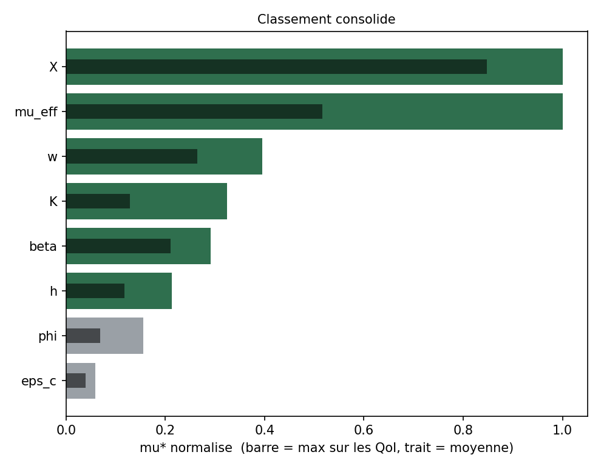
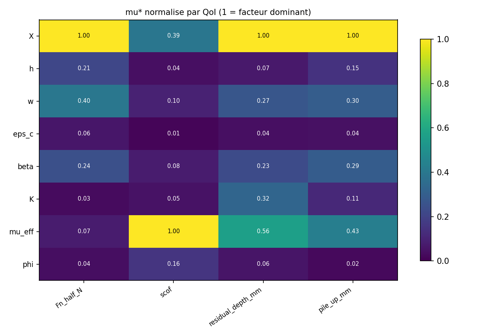
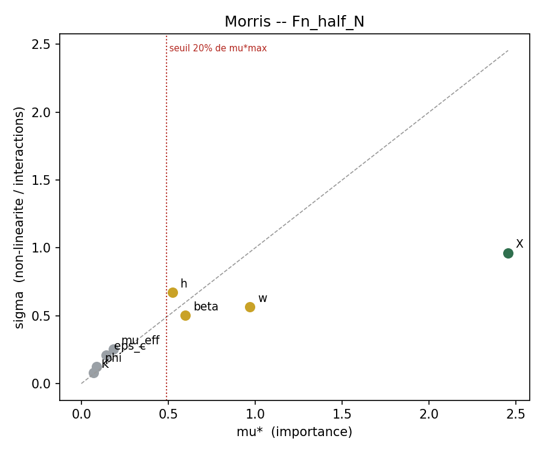
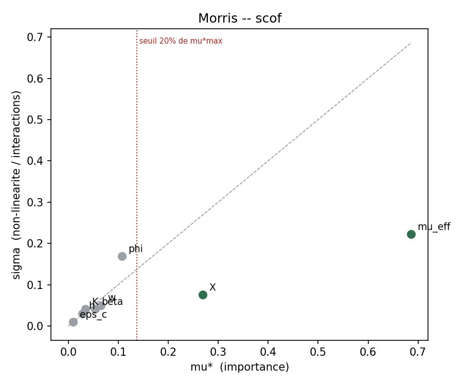
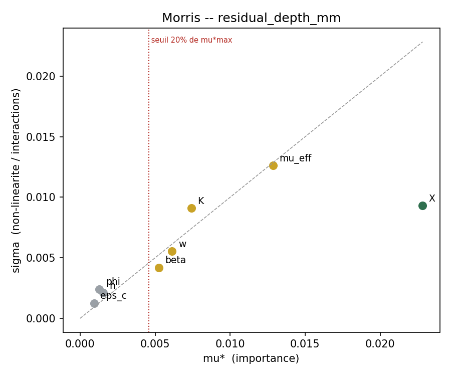
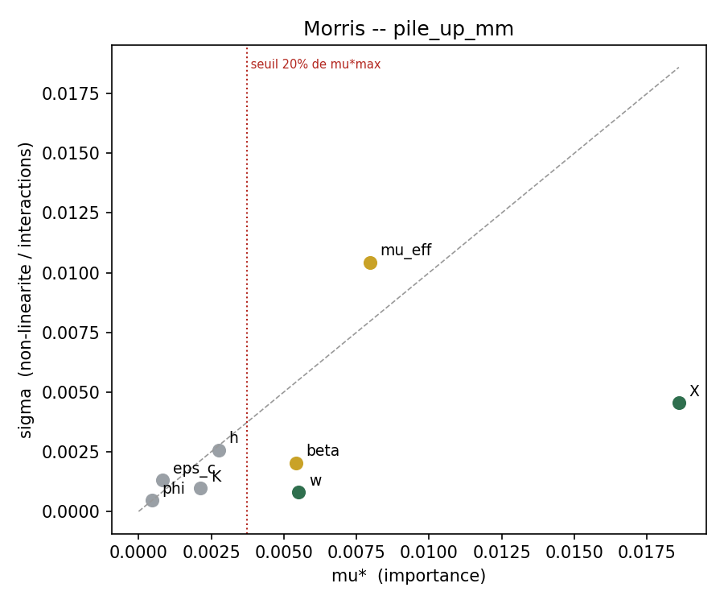

# Criblage Morris -- campagne Drucker-Prager unifiee

| | |
|---|---|
| Campagne | `CDP_drucker_prager_unified` |
| Famille hote | `glassy_pc` |
| Facteurs | 8 : `X`, `h`, `w`, `eps_c`, `beta`, `K`, `mu_eff`, `phi` |
| Trajectoires r | 10 |
| Pas Delta | 0.666667 |
| Runs prevus / exploitables | 90 / 58 |
| Trajectoires completes | 4 / 10 |
| Regle de retention | mu*_lo / mu*_max >= 0.20 (seuil relatif) |
| QoI analysees | 4 |
| Correction de multiplicite | alpha/4 sur les QoI (percentile bootstrap 1.250%) |

> **32 run(s) manquant(s) ou en echec.** Chaque point manquant detruit deux effets elementaires. Points concernes : 00012, 00013, 00014, 00015, 00016, 00017, 00018, 00037, 00038, 00039, 00040, 00041, 00042, 00043, 00050, 00051, 00052, 00053, 00054, 00057, 00058, 00059, 00060, 00061, 00062

## 1. Classement consolide

Regle appliquee : un facteur est **retenu s'il depasse le seuil de bruit pour au moins une QoI**. `mu*` est normalise par QoI (1 = facteur dominant de cette QoI), ce qui rend les colonnes comparables entre QoI d'unites differentes.

Cette regle est une **union de 4 tests par facteur**. Sans correction, le risque de retenir a tort un facteur nul atteindrait 19% ; le seuil bootstrap est donc corrige en alpha/4.

| Facteur | mu* max | mu* moyen | meilleur rang | rang moyen | sigma/mu* max | rel_lo max | QoI decisives | Verdict |
|---|---|---|---|---|---|---|---|---|
| `X` | 1 | 0.848 | 1 | 1.25 | 0.408 | 0.81 | `Fn_half_N`, `scof`, `residual_depth_mm`, `pile_up_mm` | **RETAIN** |
| `mu_eff` | 1 | 0.517 | 1 | 2.5 | 1.37 | 0.77 | `scof`, `residual_depth_mm`, `pile_up_mm` | **RETAIN** |
| `w` | 0.395 | 0.264 | 2 | 3.25 | 0.902 | 0.267 | `Fn_half_N`, `residual_depth_mm`, `pile_up_mm` | **RETAIN** |
| `K` | 0.324 | 0.129 | 3 | 5.75 | 1.23 | 0.117 | `residual_depth_mm` | **RETAIN** |
| `beta` | 0.291 | 0.211 | 3 | 4.25 | 0.84 | 0.193 | `Fn_half_N`, `residual_depth_mm`, `pile_up_mm` | **RETAIN** |
| `h` | 0.213 | 0.117 | 4 | 5.5 | 1.36 | 0.0432 | `Fn_half_N` | **RETAIN** |
| `phi` | 0.156 | 0.0683 | 3 | 6.25 | 1.88 | - | - | **freeze** |
| `eps_c` | 0.0588 | 0.0396 | 6 | 7.25 | 1.57 | - | - | **freeze** |





**Lecture.** Un `sigma/mu*` superieur a 1.0 signale un facteur dont l'effet est domine par les interactions ou par une forte non-linearite : Morris ne distingue pas les deux, seul le Sobol le fera. Un ecart important entre le meilleur rang et le rang moyen signale un facteur specifique a une QoI.

## 2. Detail par QoI

### `Fn_half_N` -- Force normale (demi-modele) [N]

46 effets elementaires, 32 point(s) manquant(s). Seuil de retention : mu* >= 0.4908 (20% du mu* maximal de cette QoI).

| Facteur | mu* | mu*_lo | mu*_hi | sigma | sigma/mu* | rel_lo | mu signe | n_eff | Verdict |
|---|---|---|---|---|---|---|---|---|---|
| `X` | 2.454 | 1.493 | 3.161 | 0.9621 | 0.392 | 0.608 | 2.454 | 6 | RETAIN |
| `w` | 0.97 | 0.4526 | 1.45 | 0.5636 | 0.581 | 0.184 | 0.97 | 6 | RETAIN? |
| `beta` | 0.5992 | 0.2044 | 1.022 | 0.5036 | 0.84 | 0.0833 | 0.5992 | 7 | RETAIN? |
| `h` | 0.5233 | 0.1059 | 1.246 | 0.6717 | 1.28 | 0.0432 | 0.5233 | 6 | RETAIN? |
| `mu_eff` | 0.1835 | 0.03761 | 0.3449 | 0.2519 | 1.37 | 0.0153 | 0.04089 | 5 | freeze |
| `eps_c` | 0.1442 | 0.03206 | 0.2975 | 0.2113 | 1.47 | 0.0131 | -0.01459 | 5 | freeze |
| `phi` | 0.08859 | 0.02063 | 0.1923 | 0.1234 | 1.39 | 0.00841 | 0.05198 | 5 | freeze |
| `K` | 0.06876 | 0.02281 | 0.1348 | 0.07825 | 1.14 | 0.0093 | -0.05745 | 6 | freeze |



### `scof` -- Coefficient de frottement apparent [-]

46 effets elementaires, 32 point(s) manquant(s). Seuil de retention : mu* >= 0.1372 (20% du mu* maximal de cette QoI).

| Facteur | mu* | mu*_lo | mu*_hi | sigma | sigma/mu* | rel_lo | mu signe | n_eff | Verdict |
|---|---|---|---|---|---|---|---|---|---|
| `mu_eff` | 0.6859 | 0.5282 | 0.9312 | 0.2227 | 0.325 | 0.77 | 0.6859 | 5 | RETAIN |
| `X` | 0.2693 | 0.2012 | 0.3292 | 0.07547 | 0.28 | 0.293 | 0.2693 | 6 | RETAIN |
| `phi` | 0.1069 | 0.01494 | 0.2619 | 0.1687 | 1.58 | 0.0218 | -0.05758 | 5 | freeze |
| `w` | 0.0655 | 0.02608 | 0.1119 | 0.05023 | 0.767 | 0.038 | -0.06437 | 6 | freeze |
| `beta` | 0.05354 | 0.02656 | 0.09155 | 0.04085 | 0.763 | 0.0387 | -0.05354 | 7 | freeze |
| `K` | 0.03402 | 0.004756 | 0.07367 | 0.04056 | 1.19 | 0.00693 | -0.03402 | 6 | freeze |
| `h` | 0.02763 | 0.00678 | 0.05574 | 0.03041 | 1.1 | 0.00988 | -0.02641 | 6 | freeze |
| `eps_c` | 0.009901 | 0.00435 | 0.0166 | 0.009717 | 0.981 | 0.00634 | 0.007606 | 5 | freeze |



### `residual_depth_mm` -- Profondeur residuelle [mm]

46 effets elementaires, 32 point(s) manquant(s). Seuil de retention : mu* >= 0.004567 (20% du mu* maximal de cette QoI).

| Facteur | mu* | mu*_lo | mu*_hi | sigma | sigma/mu* | rel_lo | mu signe | n_eff | Verdict |
|---|---|---|---|---|---|---|---|---|---|
| `X` | 0.02283 | 0.01595 | 0.03174 | 0.009312 | 0.408 | 0.698 | 0.02283 | 6 | RETAIN |
| `mu_eff` | 0.01287 | 0.004322 | 0.02527 | 0.01262 | 0.98 | 0.189 | -0.01201 | 5 | RETAIN? |
| `K` | 0.007409 | 0.002678 | 0.01398 | 0.009104 | 1.23 | 0.117 | 0.004746 | 6 | RETAIN? |
| `w` | 0.006133 | 0.003303 | 0.00895 | 0.005532 | 0.902 | 0.145 | -0.004606 | 6 | RETAIN? |
| `beta` | 0.005241 | 0.002091 | 0.008551 | 0.004193 | 0.8 | 0.0916 | -0.005104 | 7 | RETAIN? |
| `h` | 0.00154 | 0.0004469 | 0.002617 | 0.002101 | 1.36 | 0.0196 | -5.893e-06 | 6 | freeze |
| `phi` | 0.001284 | 0.000199 | 0.003875 | 0.002413 | 1.88 | 0.00872 | 0.000825 | 5 | freeze |
| `eps_c` | 0.0009289 | 0.0002992 | 0.002047 | 0.00126 | 1.36 | 0.0131 | 0.0006519 | 5 | freeze |



### `pile_up_mm` -- Bourrelet lateral [mm]

46 effets elementaires, 32 point(s) manquant(s). Seuil de retention : mu* >= 0.00372 (20% du mu* maximal de cette QoI).

| Facteur | mu* | mu*_lo | mu*_hi | sigma | sigma/mu* | rel_lo | mu signe | n_eff | Verdict |
|---|---|---|---|---|---|---|---|---|---|
| `X` | 0.0186 | 0.01506 | 0.02322 | 0.004553 | 0.245 | 0.81 | 0.0186 | 6 | RETAIN |
| `mu_eff` | 0.00796 | 0.0009569 | 0.01956 | 0.01044 | 1.31 | 0.0515 | 0.007346 | 5 | RETAIN? |
| `w` | 0.005508 | 0.004971 | 0.006295 | 0.0008046 | 0.146 | 0.267 | -0.005508 | 6 | RETAIN |
| `beta` | 0.005409 | 0.003595 | 0.00693 | 0.002038 | 0.377 | 0.193 | -0.005409 | 7 | RETAIN? |
| `h` | 0.002749 | 0.001055 | 0.00452 | 0.002572 | 0.936 | 0.0567 | -0.002278 | 6 | freeze |
| `K` | 0.002132 | 0.001348 | 0.003077 | 0.0009704 | 0.455 | 0.0725 | 0.002132 | 6 | freeze |
| `eps_c` | 0.0008283 | 0.0001145 | 0.001994 | 0.001302 | 1.57 | 0.00616 | -0.0004717 | 5 | freeze |
| `phi` | 0.0004641 | 0.0001216 | 0.001026 | 0.0004722 | 1.02 | 0.00654 | 0.0004641 | 5 | freeze |



## 3. Decision

**Retenus (6) :** `X`, `mu_eff`, `w`, `K`, `beta`, `h`

**Retenus mais marginaux (0) :** aucun

**Geles (2) :** `phi`, `eps_c`

> **Le seuil est RELATIF.** Il compare chaque facteur au plus influent de la meme QoI, il ne teste pas contre zero. Trois consequences : le facteur de tete est retenu par construction ; un `freeze` signifie *petit devant le plus grand*, **pas** *nul* ; et si tous les facteurs avaient un effet reel du meme ordre, la regle n'en gelerait aucun. Elle reduit la dimension, elle ne prouve aucune nullite.

### Sobol

```bash
python3 generate_design.py glassy_pc --method sobol --n 1024 \
        --only X,mu_eff,w,K,beta,h
```

Les facteurs marginaux sont inclus par prudence. Les facteurs non listes sont geles en milieu de plage. Passer de 8 a 6 facteurs est ce qui rend 1024 points suffisants.

## 3bis. Identifiabilite

### Signature de confusion entre facteurs

Aucune paire au-dessus du seuil 0.55 : pas de signature de confusion detectee.

| Paire | indice | QoI |
|---|---|---|
| `beta` / `K` | 0.233 | 4 |
| `w` / `K` | 0.211 | 4 |
| `h` / `K` | 0.188 | 4 |
| `X` / `w` | 0.184 | 4 |
| `w` / `mu_eff` | 0.183 | 4 |
| `X` / `beta` | 0.178 | 4 |
| `beta` / `mu_eff` | 0.176 | 4 |
| `X` / `mu_eff` | 0.132 | 4 |

## 4. Reserves

- Le classement vaut pour la **classe Drucker-Prager**, pas pour une famille particuliere : `semicrystalline_*` et `glassy_*` sont des points d'une meme boite adimensionnelle. Aucun `mu*` propre a PMMA ou PC n'en sort.
- La boite unifiee couvre des regimes physiques differents (adoucissement present ou absent). Un `sigma` eleve peut refleter ce melange plutot qu'une interaction.
- `h` intervient via `exp(h*eps^2)` evalue jusqu'a eps_max : une non-linearite forte sur ce facteur est attendue par construction du modele.
- A `phi = 1` le modele de frottement bascule de table tabulee vers Coulomb constant. Verifier que `phi = 0.99` et `phi = 1.00` donnent le meme resultat avant d'interpreter le `mu*` de `phi`.
