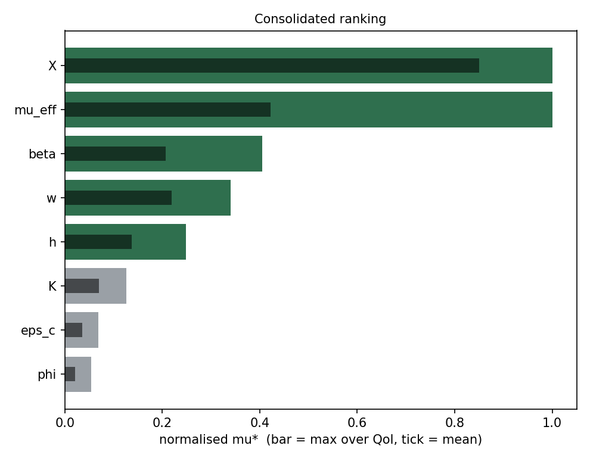
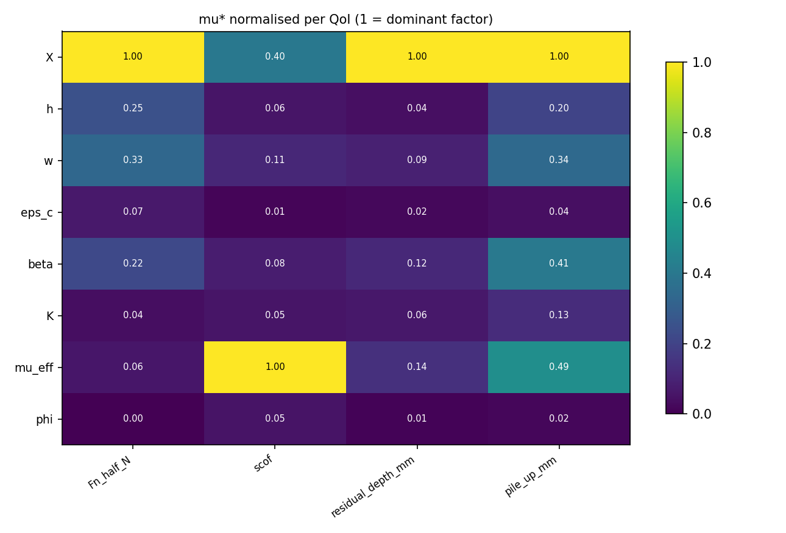
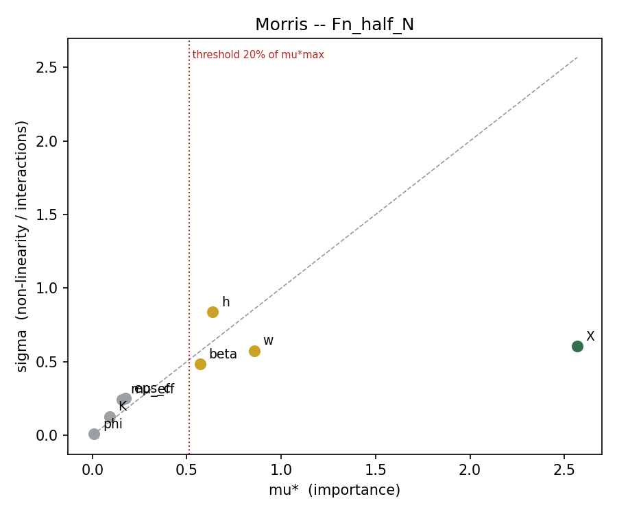
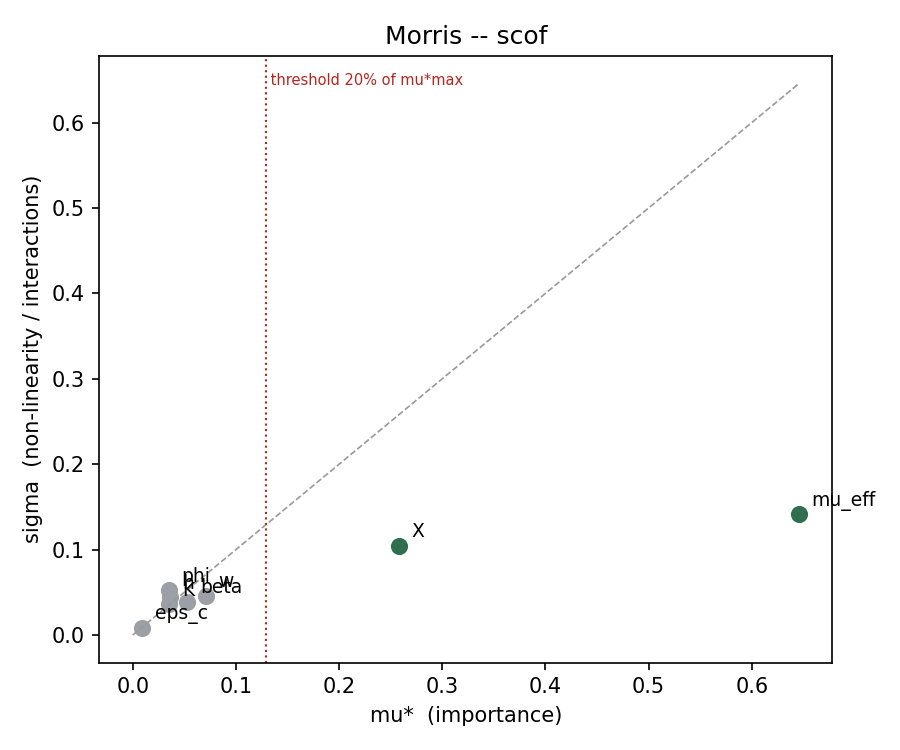
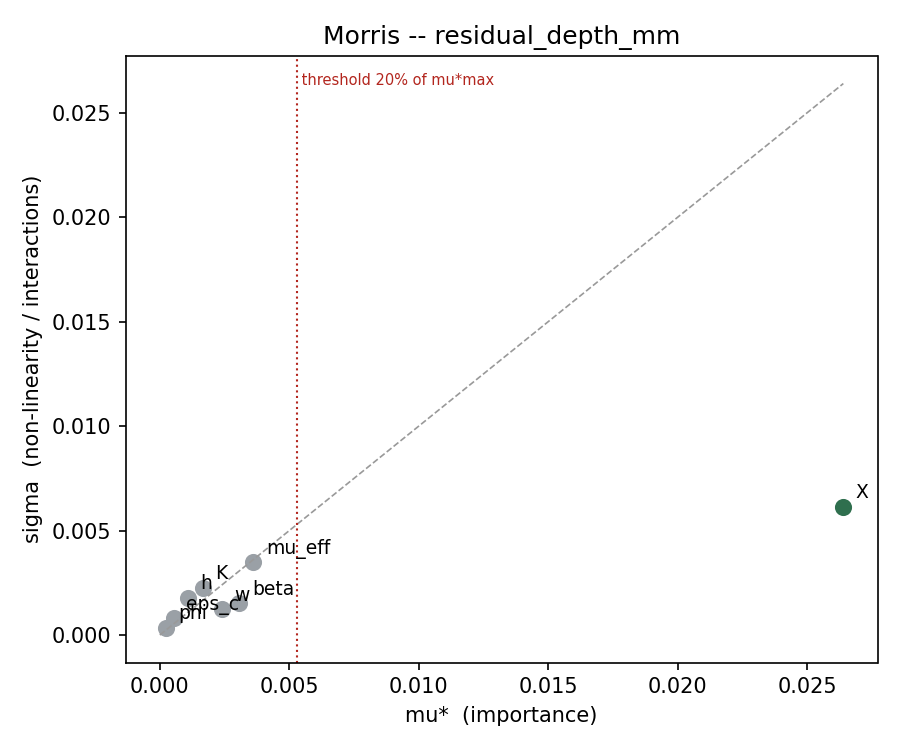
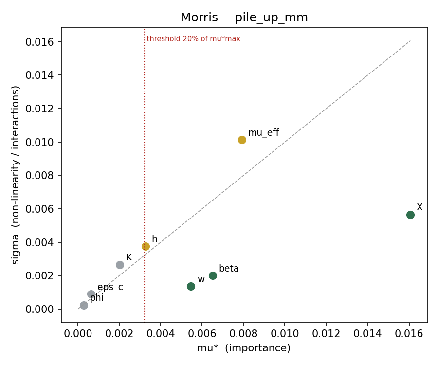

# Morris screening -- unified Drucker-Prager campaign

| | |
|---|---|
| Campaign | `CDP_drucker_prager_unified` |
| Host family | `glassy_pc` |
| Factors | 8 : `X`, `h`, `w`, `eps_c`, `beta`, `K`, `mu_eff`, `phi` |
| Trajectories r | 10 |
| Step Delta | 0.666667 |
| Planned / usable runs | 90 / 58 |
| Complete trajectories | 3 / 10 |
| Retention rule | mu*_lo / mu*_max >= 0.20 (relative threshold) |
| QoI analysed | 4 |
| Multiplicity correction | alpha/4 over QoI (bootstrap percentile 1.250%) |

> **32 missing or failed run(s).** Each missing point destroys two elementary effects. Affected ids: 00012, 00014, 00015, 00016, 00017, 00028, 00029, 00037, 00038, 00039, 00040, 00041, 00042, 00043, 00050, 00051, 00052, 00053, 00054, 00058, 00059, 00060, 00061, 00065, 00066

## 1. Consolidated ranking

Rule applied: a factor is **retained if it exceeds the threshold for at least one QoI**. `mu*` is normalised per QoI (1 = dominant factor for that QoI), which makes the columns comparable across QoI of different units.

This rule is a **union of 4 tests per factor**. Without correction, the risk of wrongly retaining a null factor would reach 19%; the bootstrap threshold is therefore corrected to alpha/4.

| Factor | mu* max | mu* mean | best rank | mean rank | sigma/mu* max | rel_lo max | deciding QoI | Verdict |
|---|---|---|---|---|---|---|---|---|
| `X` | 1 | 0.85 | 1 | 1.25 | 0.404 | 0.817 | `Fn_half_N`, `scof`, `residual_depth_mm`, `pile_up_mm` | **RETAIN** |
| `mu_eff` | 1 | 0.423 | 1 | 2.75 | 1.55 | 0.824 | `scof`, `pile_up_mm` | **RETAIN** |
| `beta` | 0.406 | 0.207 | 3 | 3.5 | 0.848 | 0.318 | `Fn_half_N`, `pile_up_mm` | **RETAIN** |
| `w` | 0.34 | 0.219 | 2 | 3.25 | 0.67 | 0.256 | `Fn_half_N`, `pile_up_mm` | **RETAIN** |
| `h` | 0.248 | 0.137 | 3 | 4.75 | 1.64 | 0.0679 | `Fn_half_N`, `pile_up_mm` | **RETAIN** |
| `K` | 0.126 | 0.0697 | 5 | 6 | 1.39 | - | - | **freeze** |
| `eps_c` | 0.0684 | 0.0358 | 5 | 6.75 | 1.48 | - | - | **freeze** |
| `phi` | 0.0543 | 0.0212 | 7 | 7.75 | 1.51 | - | - | **freeze** |





**Reading.** A `sigma/mu*` above 1.0 flags a factor whose effect is dominated by interactions or by strong non-linearity: Morris does not distinguish the two, only Sobol will. A large gap between the best rank and the mean rank flags a factor specific to one QoI.

## 2. Detail per QoI

### `Fn_half_N` -- Normal force (half-model) [N]

42 elementary effects, 32 missing point(s). Retention threshold: mu* >= 0.5137 (20% of the maximal mu* for this QoI).

| Factor | mu* | mu*_lo | mu*_hi | sigma | sigma/mu* | rel_lo | signed mu | n_eff | Verdict |
|---|---|---|---|---|---|---|---|---|---|
| `X` | 2.569 | 1.981 | 3.051 | 0.6043 | 0.235 | 0.771 | 2.569 | 6 | RETAIN |
| `w` | 0.8578 | 0.3056 | 1.449 | 0.5751 | 0.67 | 0.119 | 0.8578 | 5 | RETAIN? |
| `h` | 0.6372 | 0.07038 | 1.575 | 0.838 | 1.32 | 0.0274 | 0.6372 | 5 | RETAIN? |
| `beta` | 0.5712 | 0.1884 | 0.9792 | 0.4845 | 0.848 | 0.0734 | 0.5712 | 7 | RETAIN? |
| `eps_c` | 0.1757 | 0.06493 | 0.3624 | 0.2505 | 1.43 | 0.0253 | 0.01864 | 5 | freeze |
| `mu_eff` | 0.1567 | 0.02386 | 0.3481 | 0.2435 | 1.55 | 0.00929 | -0.03396 | 5 | freeze |
| `K` | 0.09121 | 0.01723 | 0.2353 | 0.1267 | 1.39 | 0.00671 | -0.09121 | 5 | freeze |
| `phi` | 0.009352 | 0.002504 | 0.01362 | 0.007586 | 0.811 | 0.000975 | -0.0081 | 4 | freeze |



### `scof` -- Apparent friction coefficient [-]

42 elementary effects, 32 missing point(s). Retention threshold: mu* >= 0.1291 (20% of the maximal mu* for this QoI).

| Factor | mu* | mu*_lo | mu*_hi | sigma | sigma/mu* | rel_lo | signed mu | n_eff | Verdict |
|---|---|---|---|---|---|---|---|---|---|
| `mu_eff` | 0.6457 | 0.5322 | 0.8053 | 0.1417 | 0.219 | 0.824 | 0.6457 | 5 | RETAIN |
| `X` | 0.2584 | 0.1615 | 0.3418 | 0.1045 | 0.404 | 0.25 | 0.2584 | 6 | RETAIN |
| `w` | 0.07122 | 0.02894 | 0.1208 | 0.04604 | 0.647 | 0.0448 | -0.07122 | 5 | freeze |
| `beta` | 0.05286 | 0.0262 | 0.08879 | 0.03922 | 0.742 | 0.0406 | -0.05286 | 7 | freeze |
| `h` | 0.03569 | 0.001402 | 0.08452 | 0.044 | 1.23 | 0.00217 | -0.03569 | 5 | freeze |
| `K` | 0.03531 | 0.006487 | 0.07708 | 0.03577 | 1.01 | 0.01 | -0.03531 | 5 | freeze |
| `phi` | 0.03507 | 0.003061 | 0.1112 | 0.05249 | 1.5 | 0.00474 | 0.03353 | 4 | freeze |
| `eps_c` | 0.009286 | 0.001539 | 0.01675 | 0.008739 | 0.941 | 0.00238 | 0.008721 | 5 | freeze |



### `residual_depth_mm` -- Residual depth [mm]

42 elementary effects, 32 missing point(s). Retention threshold: mu* >= 0.005279 (20% of the maximal mu* for this QoI).

| Factor | mu* | mu*_lo | mu*_hi | sigma | sigma/mu* | rel_lo | signed mu | n_eff | Verdict |
|---|---|---|---|---|---|---|---|---|---|
| `X` | 0.0264 | 0.02156 | 0.03225 | 0.006147 | 0.233 | 0.817 | 0.0264 | 6 | RETAIN |
| `mu_eff` | 0.003617 | 0.0007475 | 0.007396 | 0.003485 | 0.963 | 0.0283 | -0.003617 | 5 | freeze |
| `beta` | 0.003068 | 0.001748 | 0.004287 | 0.001537 | 0.501 | 0.0662 | -0.003068 | 7 | freeze |
| `w` | 0.002383 | 0.00126 | 0.003669 | 0.001247 | 0.523 | 0.0477 | -0.002383 | 5 | freeze |
| `K` | 0.001655 | 0.0002227 | 0.003806 | 0.002262 | 1.37 | 0.00844 | 0.001142 | 5 | freeze |
| `h` | 0.001091 | 0.0001582 | 0.003023 | 0.001791 | 1.64 | 0.00599 | -0.001091 | 5 | freeze |
| `eps_c` | 0.0005464 | 0.0001448 | 0.001137 | 0.0008063 | 1.48 | 0.00548 | -2.448e-05 | 5 | freeze |
| `phi` | 0.0002369 | 3.247e-05 | 0.0005304 | 0.0003579 | 1.51 | 0.00123 | -6.557e-05 | 4 | freeze |



### `pile_up_mm` -- Lateral pile-up [mm]

42 elementary effects, 32 missing point(s). Retention threshold: mu* >= 0.003213 (20% of the maximal mu* for this QoI).

| Factor | mu* | mu*_lo | mu*_hi | sigma | sigma/mu* | rel_lo | signed mu | n_eff | Verdict |
|---|---|---|---|---|---|---|---|---|---|
| `X` | 0.01607 | 0.01158 | 0.02124 | 0.005664 | 0.353 | 0.721 | 0.01607 | 6 | RETAIN |
| `mu_eff` | 0.007921 | 0.001762 | 0.01722 | 0.01013 | 1.28 | 0.11 | 0.005697 | 5 | RETAIN? |
| `beta` | 0.006517 | 0.005113 | 0.008151 | 0.001996 | 0.306 | 0.318 | -0.006517 | 7 | RETAIN |
| `w` | 0.005463 | 0.004113 | 0.006778 | 0.001373 | 0.251 | 0.256 | -0.005463 | 5 | RETAIN |
| `h` | 0.003271 | 0.001091 | 0.004545 | 0.003756 | 1.15 | 0.0679 | -0.001507 | 5 | RETAIN? |
| `K` | 0.00202 | 0.000231 | 0.004354 | 0.002661 | 1.32 | 0.0144 | 0.001473 | 5 | freeze |
| `eps_c` | 0.0006397 | 0.0002001 | 0.00128 | 0.0009028 | 1.41 | 0.0125 | -0.0001305 | 5 | freeze |
| `phi` | 0.0002862 | 2.172e-06 | 0.0005791 | 0.0002388 | 0.834 | 0.000135 | 0.0002851 | 4 | freeze |



## 3. Decision

**Retained (5):** `X`, `mu_eff`, `beta`, `w`, `h`

**Retained but marginal (0):** none

**Frozen (3):** `K`, `eps_c`, `phi`

> **The threshold is RELATIVE.** It compares each factor to the most influential one of the same QoI, it does not test against zero. Three consequences: the top factor is retained by construction; a `freeze` means *small compared to the largest*, **not** *null*; and if every factor had a real effect of the same order, the rule would freeze none of them. It reduces dimensionality, it does not prove any nullity.

### Sobol

```bash
python3 generate_design.py glassy_pc --method sobol --n 1024 \
        --only X,mu_eff,beta,w,h
```

Marginal factors are included as a precaution. Unlisted factors are frozen at mid-range. Going from 8 to 5 factors is what makes 1024 points enough.

## 3bis. Identifiability

### Confounding signature between factors

No pair above the threshold 0.55: no confounding signature detected.

| Pair | index | QoI |
|---|---|---|
| `h` / `phi` | 0.248 | 4 |
| `K` / `phi` | 0.244 | 4 |
| `w` / `K` | 0.214 | 4 |
| `h` / `K` | 0.202 | 4 |
| `beta` / `K` | 0.19 | 4 |
| `beta` / `mu_eff` | 0.183 | 4 |
| `X` / `beta` | 0.182 | 4 |
| `X` / `w` | 0.176 | 4 |

## 4. Caveats

- The ranking holds for the **Drucker-Prager class**, not for any single family: `semicrystalline_*` and `glassy_*` are points of the same dimensionless box. No `mu*` specific to PMMA or PC comes out of it.
- The unified box spans different physical regimes (softening present or absent). A high `sigma` may reflect this mixture rather than an interaction.
- `h` enters via `exp(h*eps^2)` evaluated up to eps_max: strong non-linearity on this factor is expected by construction of the model.
- At `phi = 1` the friction model switches from a tabulated table to constant Coulomb. Check that `phi = 0.99` and `phi = 1.00` give the same result before interpreting the `mu*` of `phi`.
