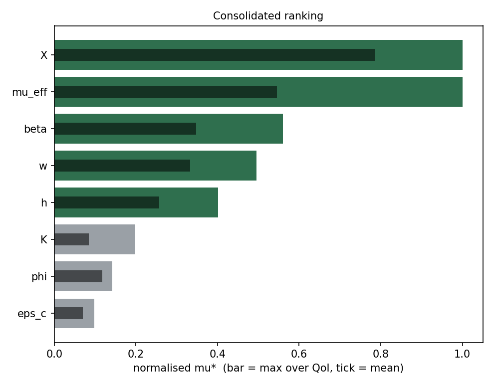
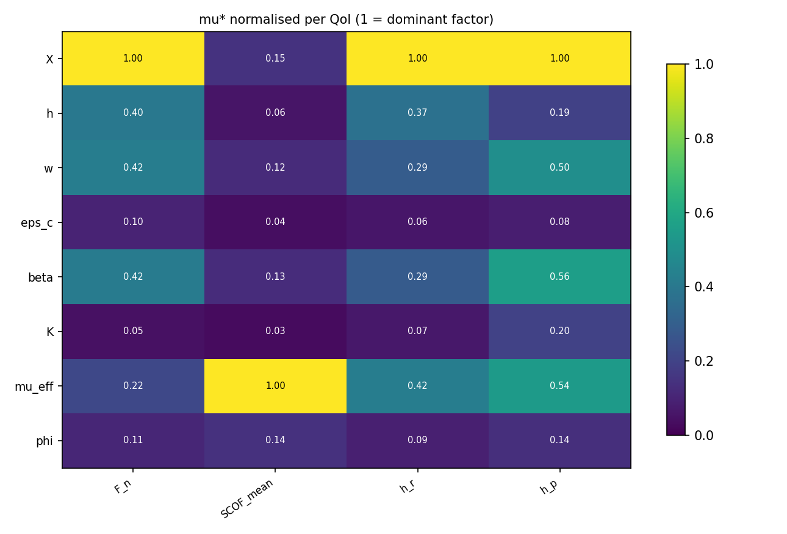
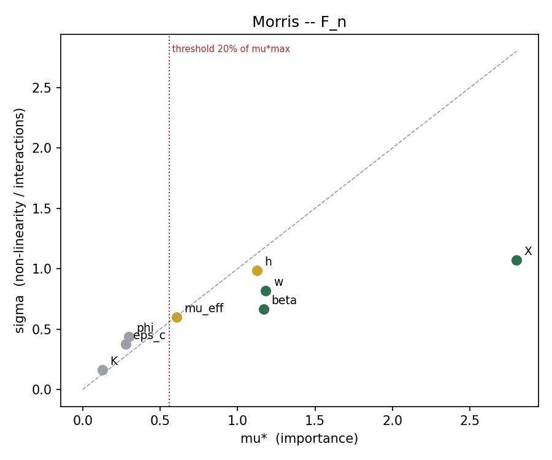
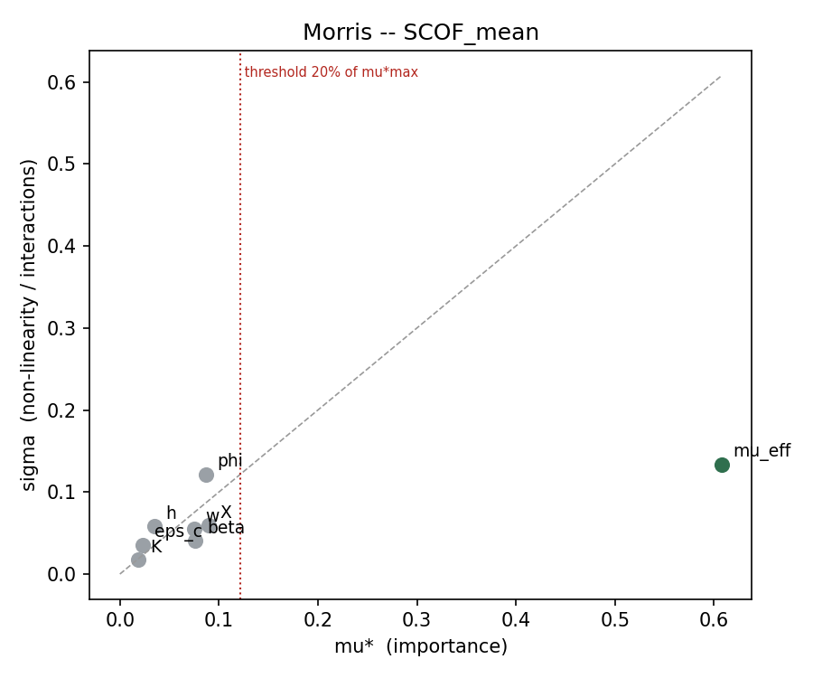
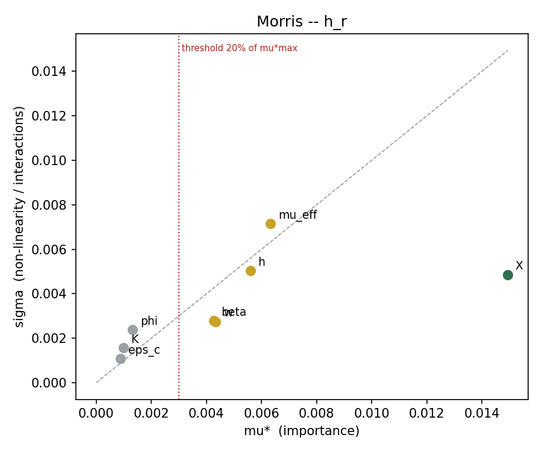
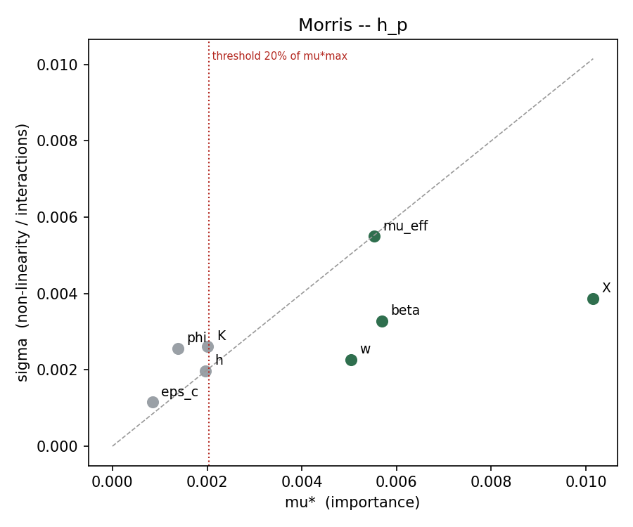

# Morris screening -- unified Drucker-Prager campaign

| | |
|---|---|
| Campaign | `CDP_drucker_prager_unified` |
| Host family | `glassy_pc` |
| Factors | 8 : `X`, `h`, `w`, `eps_c`, `beta`, `K`, `mu_eff`, `phi` |
| Trajectories r | 10 |
| Step Delta | 0.666667 |
| Planned / usable runs | 90 / 90 |
| Complete trajectories | 10 / 10 |
| Retention rule | mu*_lo / mu*_max >= 0.20 (relative threshold) |
| QoI analysed | 4 |
| Multiplicity correction | alpha/4 over QoI (bootstrap percentile 1.250%) |

## 1. Consolidated ranking

Rule applied: a factor is **retained if it exceeds the threshold for at least one QoI**. `mu*` is normalised per QoI (1 = dominant factor for that QoI), which makes the columns comparable across QoI of different units.

This rule is a **union of 4 tests per factor**. Without correction, the risk of wrongly retaining a null factor would reach 19%; the bootstrap threshold is therefore corrected to alpha/4.

| Factor | mu* max | mu* mean | best rank | mean rank | sigma/mu* max | rel_lo max | deciding QoI | Verdict |
|---|---|---|---|---|---|---|---|---|
| `X` | 1 | 0.787 | 1 | 1.25 | 0.658 | 0.782 | `F_n`, `h_r`, `h_p` | **RETAIN** |
| `mu_eff` | 1 | 0.546 | 1 | 2.75 | 1.13 | 0.891 | `F_n`, `SCOF_mean`, `h_r`, `h_p` | **RETAIN** |
| `beta` | 0.56 | 0.347 | 2 | 3.5 | 0.652 | 0.338 | `F_n`, `h_r`, `h_p` | **RETAIN** |
| `w` | 0.496 | 0.333 | 2 | 3.75 | 0.736 | 0.347 | `F_n`, `h_r`, `h_p` | **RETAIN** |
| `h` | 0.401 | 0.257 | 3 | 4.75 | 1.66 | 0.199 | `F_n`, `h_r` | **RETAIN** |
| `K` | 0.198 | 0.0849 | 5 | 7 | 1.6 | - | - | **freeze** |
| `phi` | 0.142 | 0.118 | 3 | 5.5 | 1.86 | - | - | **freeze** |
| `eps_c` | 0.0987 | 0.0698 | 7 | 7.5 | 1.55 | - | - | **freeze** |





**Reading.** A `sigma/mu*` above 1.0 flags a factor whose effect is dominated by interactions or by strong non-linearity: Morris does not distinguish the two, only Sobol will. A large gap between the best rank and the mean rank flags a factor specific to one QoI.

## 2. Detail per QoI

### `F_n` -- Normal force (half-model) [N]

80 elementary effects. Retention threshold: mu* >= 0.56 (20% of the maximal mu* for this QoI).

| Factor | mu* | mu*_lo | mu*_hi | sigma | sigma/mu* | rel_lo | signed mu | n_eff | Verdict |
|---|---|---|---|---|---|---|---|---|---|
| `X` | 2.8 | 2.099 | 3.511 | 1.071 | 0.382 | 0.75 | 2.8 | 10 | RETAIN |
| `w` | 1.183 | 0.6372 | 1.721 | 0.8181 | 0.692 | 0.228 | 1.183 | 10 | RETAIN |
| `beta` | 1.169 | 0.7318 | 1.613 | 0.6649 | 0.569 | 0.261 | 1.169 | 10 | RETAIN |
| `h` | 1.124 | 0.5585 | 1.868 | 0.9827 | 0.874 | 0.199 | 1.124 | 10 | RETAIN? |
| `mu_eff` | 0.6066 | 0.2843 | 1.016 | 0.5998 | 0.989 | 0.102 | -0.5653 | 10 | RETAIN? |
| `phi` | 0.2973 | 0.08112 | 0.5637 | 0.4374 | 1.47 | 0.029 | 0.2009 | 10 | freeze |
| `eps_c` | 0.2764 | 0.1238 | 0.4614 | 0.3748 | 1.36 | 0.0442 | 0.09837 | 10 | freeze |
| `K` | 0.1264 | 0.04917 | 0.2313 | 0.1632 | 1.29 | 0.0176 | -0.0989 | 10 | freeze |



### `SCOF_mean` -- Apparent friction coefficient [-]

80 elementary effects. Retention threshold: mu* >= 0.1216 (20% of the maximal mu* for this QoI).

| Factor | mu* | mu*_lo | mu*_hi | sigma | sigma/mu* | rel_lo | signed mu | n_eff | Verdict |
|---|---|---|---|---|---|---|---|---|---|
| `mu_eff` | 0.6078 | 0.5413 | 0.7096 | 0.1339 | 0.22 | 0.891 | 0.6078 | 10 | RETAIN |
| `X` | 0.0896 | 0.04833 | 0.1268 | 0.059 | 0.658 | 0.0795 | 0.0896 | 10 | freeze |
| `phi` | 0.08656 | 0.02368 | 0.1723 | 0.1217 | 1.41 | 0.039 | -0.0764 | 10 | freeze |
| `beta` | 0.07627 | 0.04931 | 0.1043 | 0.04066 | 0.533 | 0.0811 | -0.07627 | 10 | freeze |
| `w` | 0.07473 | 0.04256 | 0.1155 | 0.05499 | 0.736 | 0.07 | -0.07473 | 10 | freeze |
| `h` | 0.03503 | 0.007155 | 0.07087 | 0.05821 | 1.66 | 0.0118 | -0.01578 | 10 | freeze |
| `eps_c` | 0.02316 | 0.008158 | 0.04453 | 0.03582 | 1.55 | 0.0134 | -0.008496 | 10 | freeze |
| `K` | 0.01869 | 0.007671 | 0.03139 | 0.01747 | 0.935 | 0.0126 | -0.01865 | 10 | freeze |



### `h_r` -- Residual depth [mm]

80 elementary effects. Retention threshold: mu* >= 0.002988 (20% of the maximal mu* for this QoI).

| Factor | mu* | mu*_lo | mu*_hi | sigma | sigma/mu* | rel_lo | signed mu | n_eff | Verdict |
|---|---|---|---|---|---|---|---|---|---|
| `X` | 0.01494 | 0.01163 | 0.01829 | 0.004861 | 0.325 | 0.779 | 0.01494 | 10 | RETAIN |
| `mu_eff` | 0.006329 | 0.002236 | 0.01133 | 0.007142 | 1.13 | 0.15 | 0.006003 | 10 | RETAIN? |
| `h` | 0.005594 | 0.00239 | 0.009301 | 0.005039 | 0.901 | 0.16 | -0.005594 | 10 | RETAIN? |
| `w` | 0.004342 | 0.002626 | 0.006421 | 0.002741 | 0.631 | 0.176 | -0.004342 | 10 | RETAIN? |
| `beta` | 0.004271 | 0.002654 | 0.006363 | 0.002786 | 0.652 | 0.178 | -0.004271 | 10 | RETAIN? |
| `phi` | 0.001323 | 0.0003412 | 0.003154 | 0.002381 | 1.8 | 0.0228 | -0.0009785 | 10 | freeze |
| `K` | 0.0009772 | 0.0003285 | 0.001875 | 0.001563 | 1.6 | 0.022 | 7.786e-05 | 10 | freeze |
| `eps_c` | 0.0008844 | 0.0004578 | 0.001357 | 0.001084 | 1.23 | 0.0306 | -0.0003553 | 10 | freeze |



### `h_p` -- Lateral pile-up [mm]

80 elementary effects. Retention threshold: mu* >= 0.00203 (20% of the maximal mu* for this QoI).

| Factor | mu* | mu*_lo | mu*_hi | sigma | sigma/mu* | rel_lo | signed mu | n_eff | Verdict |
|---|---|---|---|---|---|---|---|---|---|
| `X` | 0.01015 | 0.007936 | 0.01324 | 0.003871 | 0.381 | 0.782 | 0.01015 | 10 | RETAIN |
| `beta` | 0.005689 | 0.003426 | 0.007854 | 0.00328 | 0.577 | 0.338 | -0.005689 | 10 | RETAIN |
| `mu_eff` | 0.00553 | 0.002948 | 0.008125 | 0.005503 | 0.995 | 0.29 | 0.004125 | 10 | RETAIN |
| `w` | 0.005035 | 0.003518 | 0.006653 | 0.002271 | 0.451 | 0.347 | -0.005035 | 10 | RETAIN |
| `K` | 0.002012 | 0.0006673 | 0.003724 | 0.002622 | 1.3 | 0.0657 | 0.001645 | 10 | freeze |
| `h` | 0.00197 | 0.0008355 | 0.003135 | 0.001977 | 1 | 0.0823 | -0.001744 | 10 | freeze |
| `phi` | 0.001382 | 0.0003966 | 0.003143 | 0.002564 | 1.86 | 0.0391 | -0.0002079 | 10 | freeze |
| `eps_c` | 0.000843 | 0.0003559 | 0.001424 | 0.001156 | 1.37 | 0.0351 | -0.0003047 | 10 | freeze |



## 3. Decision

**Retained (5):** `X`, `mu_eff`, `beta`, `w`, `h`

**Retained but marginal (0):** none

**Frozen (3):** `K`, `phi`, `eps_c`

> **The threshold is RELATIVE.** It compares each factor to the most influential one of the same QoI, it does not test against zero. Three consequences: the top factor is retained by construction; a `freeze` means *small compared to the largest*, **not** *null*; and if every factor had a real effect of the same order, the rule would freeze none of them. It reduces dimensionality, it does not prove any nullity.

### Sobol

```bash
python3 generate_design.py glassy_pc --method sobol --n 1024 \
        --only X,mu_eff,beta,w,h
```

Marginal factors are included as a precaution. Unlisted factors are frozen at mid-range. Going from 8 to 5 factors is what makes 1024 points enough.

## 3bis. Identifiability

### Confounding signature between factors

No pair above the threshold 0.55: no confounding signature detected.

| Pair | index | QoI |
|---|---|---|
| `beta` / `mu_eff` | 0.494 | 4 |
| `w` / `mu_eff` | 0.483 | 4 |
| `X` / `beta` | 0.424 | 4 |
| `X` / `w` | 0.405 | 4 |
| `h` / `mu_eff` | 0.401 | 4 |
| `X` / `phi` | 0.235 | 4 |
| `h` / `K` | 0.203 | 4 |
| `X` / `h` | 0.181 | 4 |

## 3ter. Numerical quality indicators

These are **indicators only**. No run is excluded on any of them: the energy diagnostics are reported so that a systematic drift stays visible, and every parsed run feeds the elementary effects regardless of the values below. On a deliberately coarse mesh, exceeding these limits is expected and is not a reason to discard the run.

| Indicator | Limit | Over limit | Median | p90 | Max | Worst ids |
|---|---|---|---|---|---|---|
| `KE_IE_steady_max` | 5 % | 11 / 90 (12.2%) | 0.245 | 5.53 | 7.88 | 00051, 00052, 00053, 00054, 00050 |
| `AE_IE_final` | 5 % | 29 / 90 (32.2%) | 3.68 | 8.33 | 14.4 | 00028, 00029, 00030, 00069, 00067 |
| `ETOTAL_drift` | 5 % | 0 / 90 (0%) | 0.607 | 1.76 | 4.26 | - |
| `ALLPW` | 5 % | 2 / 90 (2.22%) | 2.7 | 3.58 | 5.86 | 00057, 00056 |
| `KE_final_over_IE_peak` | 1 % | 0 / 90 (0%) | 0.00345 | 0.0109 | 0.0151 | - |

**How to read this.** An indicator exceeded by nearly EVERY run points at a systematic setting shared by the whole campaign (element control, mass scaling, ALE frequency, mesh size), not at individual runs. An indicator exceeded by a HANDFUL of runs points at a corner of the factor box; cross the worst ids above with the design to find which factor level they share. In both cases the action is to change the setting or to document the bias, never to drop the runs.

## 4. Caveats

- The ranking holds for the **Drucker-Prager class**, not for any single family: `semicrystalline_*` and `glassy_*` are points of the same dimensionless box. No `mu*` specific to PMMA or PC comes out of it.
- The unified box spans different physical regimes (softening present or absent). A high `sigma` may reflect this mixture rather than an interaction.
- `h` enters via `exp(h*eps^2)` evaluated up to eps_max: strong non-linearity on this factor is expected by construction of the model.
- `phi` is capped below 1 in the sampling box precisely because `phi = 1` switches the friction model from a tabulated Briscoe table to constant Coulomb -- a change of model class, not a variation of a factor. If a design predating that cap is analysed here, the `mu*` of `phi` mixes the two.
- Quality indicators (section 3ter) never exclude a run. A campaign run on a coarse mesh for turnaround will exceed them by construction; that is a known bias to report, not a reason to shrink the design.
